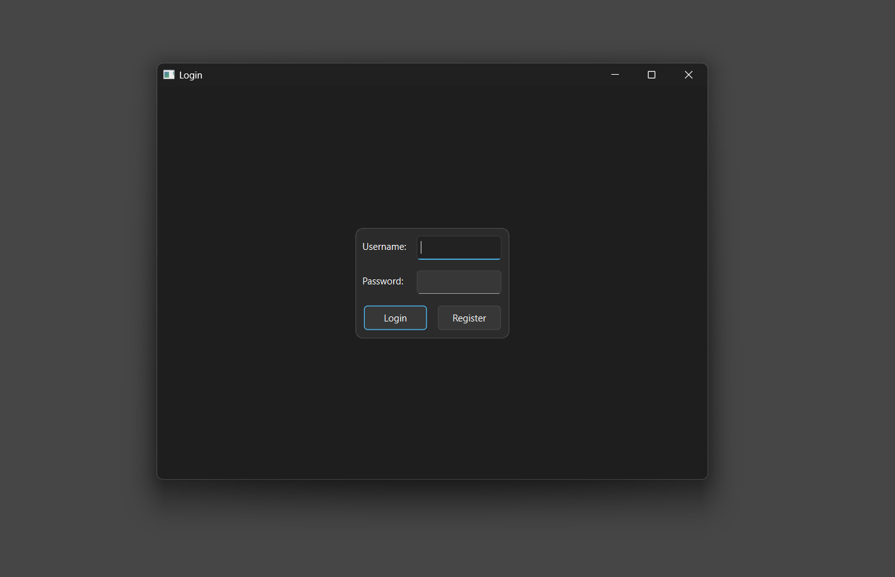

# Student Management System (user:ADMIN) (Code with QT creator and VS2022)

### 1 Student Manager ✔
- Login screen with username and password. Users can create an account if they don't have one.
- Implement CRUD operations and display student information in a table (similar to Excel).
- Save student data in a Json file.
- Manage class information.
- View detailed information for each student.
- Upload student images from the user device and store them with student data.
- Save student information along with their class.
  
### 2 Courses Manager ✔
- Implement CRUD for courses.
- Each course can have students added by name + student ID.
- Selecting a course shows the correct list of students enrolled.
- UI with clear, distinguishable menu and layout.
- Support saving/loading all course data along with student information.
- Create a dialog to manage student roster for each course.
- Add students in the course directly from the dialog.
- Display student info (name + id) in a table inside the dialog.
- Integrate with course CRUD so changes are saved/loaded properly.

### 3 Scores ✔
- Manage student grades per course.
- Dropdowns to select student and course.
- Input fields for process (0–10, 60%) and final (0–10, 40%).
- Buttons: add/update to save grades, delete to remove.
- Table shows: student, course, process, final, total.
- Total = process × 0.6 + final × 0.4, auto-calculated.
- Filters table by selected student or course.
- Save/load all scores to/from Json.
  
### 4 Dashboard ✔
- Overview of the system with quick stats: students, courses, scores counts.
- Top Students table ranked by total score: rank, id, name, score.
- Quick action buttons: view courses, save courses, load courses.
- Auto-updates when students, courses, or scores change.
- Displays rankings based on total accumulated scores across courses.

## 🎬 Demo  

### Login  

  

### Menu  

  

